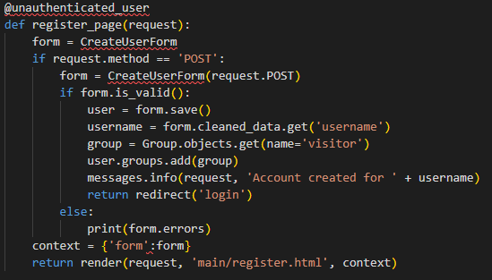
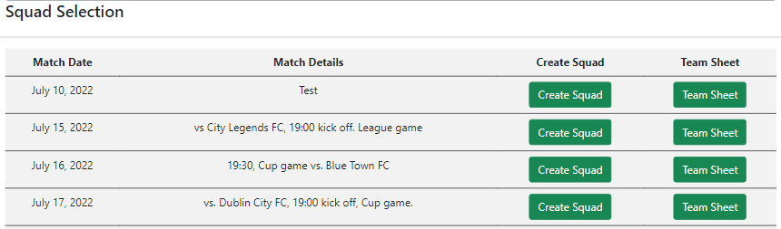
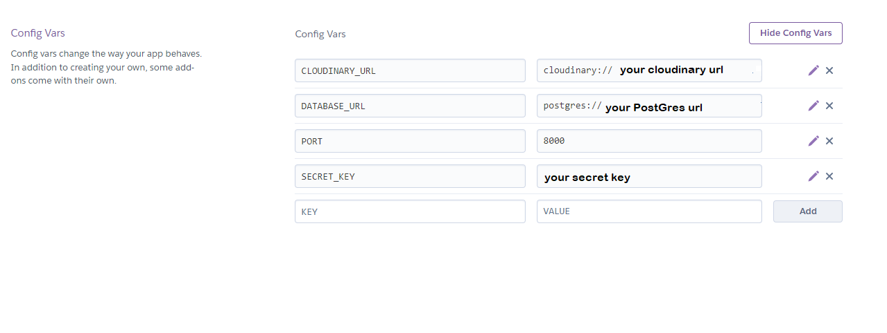

# An Seo
​
<span style="font-weight:bold; font-size:16px">
[An Seo](https://an-seo.herokuapp.com/) is a web-based application which allows managers and coaches to track the attendance of their players at training and for matches. The application is primarily designed for underage and amateur sports.</span> 
<br>
[This is an external link to An Seo](https://an-seo.herokuapp.com/)

For this purposes I have listed login at this link : [User Test Information](#user-test-information)

<br>

<span style="color:#56a832; font-weight:bold; font-size:16px">Origins of the application.</span>
<p> The initial inspiration for the application was formed while I was assisting with the coaching of my daughters Camogie team. I became aware that the manager was using a hand written list to record player attendance.</p>
<p>I initially assumed that this list was acting as some form of track and trace to comply with Covid regulations. When I asked the manager about the purpose of the list, he told me he was recording player attendance at every training session in to help him fairly pick his teams. The information would also serve as record which could easily settle any little disputes that parents or guardians may have about their child's game time.</p>
<p>The manager then shared a link to a Google Drive containing Google Sheets where he was recording the attendance. He would bring home the paper list and manually update the Google Sheets.</p>

<span style="color:#ebd80c; font-weight:bold; font-size:16px">A proposed solution.</span>
<p>Having looked at the Google Sheets it appeared to me that the data recorded would be better stored in a database and so was very suitable for use in a Django driven project.</p>
<p>At its basis, the problem could be easily addressed with a cloud based application
</p>
<ul>
<li>Data located in the cloud which would be easily updateable through a mobile device.</li>
<li>Data would be collected, and the database would be updated in the same process.</li>
<li>Any query or queries called from the data would be updated with the fresh data.</li>
</ul>
<p>It also seemed clear that once the manager/site owner was recording this data then it could be used for further purpose and features to enhance the use and function of the application.</p>

<br>

<p align="center" width="100%"> 

</p>


​

## Contents
​
- [Anseo](#contents)
  - [Contents](#contents)
  - [UX](#ux)
    - [Project Goals](#project-goals)
    - [Site Owner Goals](#site-owner-goals)
    - [Site Visitor/User Goals](#site-visitoruser-goals)
    - [User Stories](#user-stories)
    - [User Requirements and Expectations](#user-requirements-and-expectations)
      - [Requirements](#requirements)
      - [Expectations](#expectations)
    - [Design Choices](#design-choices)
      - [Fonts](#fonts)
      - [Colours](#colours)
      - [Images](#images)
      - [Agile Methodology](#agile-methodology)
  - [Wireframes](#wireframes)
    - [Site Layout](#site-layout)
  - [Information Architecture](#information-architecture)
  - [Technologies](#technologies)
    - [Languages](#languages)
    - [Libraries & Frameworks](#libraries--frameworks)
    - [Tools](#tools)
  - [Features](#features)
    - [Implemented Features](#implemented-features)
    - [Future Features](#future-features)
  - [Testing](#testing)
    - [User Test Information](#user-test-information)
  - [Deployment](#deployment)
    - [Final Deployment](#final-deployment)
    - [Cloning](#cloning)
  - [Credits](#credits)
    - [Image editing](#image-editing)
    - [Code ideas](#code-ideas)
  

​
---
​

## UX
​
### **Project Goals**
​
The main goal of this project is to provide coaches of sports teams the ability to track the attendance of the players at training sessions. This data then gives the user a simple visual guide as to which players are regularly participating and so aid the coach/manager in portioning game time when it comes to competitive games and matches. The application was primarily designed for underage amateur sport but could be used at any level.

​
### **Site Owner Goals**
​
- Provide the users with a simple system to collect information and display that information in a simple readable format.
​
<br>

### **Site Visitor/User Goals**
​
- Site visitors will have the ability to view the details of upcoming training sessions and match fixtures. The typical site visitor will be a parent or guardian of a child who is part of the team or a member of a team itself.
<br>
- Site users will have the ability to...
    
    <ul>
    <li>Create, Update and Delete Players.</li>
    <li>Create, Update and Delete Training Sessions.</li>
    <li>Create, Update and Delete Matches.</li>
    <li>View player attendance histories.</li>
    <li>View records of training sessions.</li>
    <li>View records of team selections.</li>
    </ul>

​
### **User Stories**
​
**Applies to all site users:**
​
- As a user, I am able to...view upcoming training sessions and matches.

​
**Applies to a superuser (site owner):**
​
- As a user, I am able to...
<ul>
<li> Create, update and delete Players. </li>
<li> Create, update and delete Training Sessions. </li>
<li> Create, update and delete Match/Fixtures. </li>
<li> View a players attendance at training. </li>
<li> View a players attendance at games. </li>
</ul>
​<br>

[Back to content](#contents)

---
​
### User Requirements and Expectations
​
#### **Requirements**
​
- Visually pleasant app design
- Easy site navigation
- Content laid out in a simple and clear way on both mobile and larger screens
- Self-explanatory icons where text is absent
​
#### **Expectations**
​
- Easy to use interface.
- Clear and easy to read data.

​<br>
[Back to content](#contents)

---
​
### **Design Choices**

The site/application is designed and styled using Bootstrap and is presented in a 'dashboard' style layout. With the focus of the application being on the display of information and functionality I have made the design choices based around this.   
​
#### **Fonts**
I have decided against using Font Awesome or any other resource Font library, I have used the default Bootstrap font library.

- *All fonts* 

​
  ```font-family: Bootstrap standard font -  sans-serif;```
<br>

#### **Images**
The only image I am using is the logo which I created in a desktop publishing application. I have given the application the name 'An Seo' which is the Irish / Gaelic for 'here'. Anyone of certain age who attended primary school in Ireland would be familiar with the phrase as response to a teacher calling your name to take a class attendance.

<p align="center" width="100%"> 

</p>

<br>
A Favicon was created and stored in the static directory.
<br>

<p align="center" width="100%"> 

</p>

<br>

#### **Colors**
After experimentation the background color has been left white for screen brightness and outdoor function.
<ol>
<li>This will help keep the screen bright and 'clean'</li>
<li>White offers a better contrast with the displayed information</li>
</ol>

To break this white colour I have added two colors, a green and a yellow, to style some container and card items and create some divisions on the screen. 

<p align="center" width="100%"> 

</p>
​
Any other color on the screen is from the Bootstrap styled buttons. The only exception to this is the colour on the Player Dashboard section which signifies the players attendance record.
​
<br>
<br>

#### **Agile Methodology**


The design, development and testing of this application were tracked through a project opened in GitHub and associated with the application repository. The Project and Kanban board are located [here](https://github.com/TNolan01/player_track/projects/1).

The Kanban board in the GitHub repository was used to track issues raised during testing and development.

<br>

<p align="center" width="100%"> 

</p>

<br>


[Back to content](#contents)
​

---
## Wireframes
​
### **Site Layout**
​The site layout and mock-ups sketches were drawn free hand with pen and paper. The design of the program lead me to believe that a dashboard layout would suit the application best. Once I had preliminary sketches I researched some Bootstrap layouts which would suit and immediately moved to screen designed layout.

Preliminary wireframe sketches were made to create initial structure to the screen layout and the content.

<br>

<p align="center" width="100%"> 

</p>

<br>

<p align="center" width="100%"> 

</p>

<br>

<p align="center" width="100%"> 

</p>

<br>


As the sketches were rendered on screen with Bootstrap there were changes to the UX design and layout. Further slight style changes were made early in the design process following some live testing.
​

[Back to content](#contents)
​

---
​
## Information Architecture
​
### **PostgreSQL Database**
The backend database is a PostgreSQL Database hosted via Heroku. The database is built around 5 models.
#### **Models:**
<ul>
<li>Club</li>
<li>Team Selection</li>
<li>Match</li>
<li>Session</li>
<li>Player</li>
</ul>
<br>

<p align="center" width="100%"> 

</p>

<br>


**Club Model**

This model holds only one field at present. I am using this to hold the Name of the club for which the data relates to. The club's name value is then displayed on the Main Dashboard. 

**Team Selection Model**

The Team Selection Model holds match related data. The model combines the instance of a particular match and allows the user add a player to that match. The coach can also give the player and jersey number and status of *starting* the match or *substitute*. 
The model also contains fields *goals, points* and *notes*. It is envisaged that these fields would be used in an **In Play** module which would form part of [Future Features](#future-features).

**Match Model**

This model is for the creation of a new match fixture. It holds *date, details* and *venue*. 

**Session Model**

The Session model is for the creation of a new training session. This model was the basis for the site. I spent considerable time getting this model and its subsquent content correct. 

I want to follow a simple sequence
<ol>
<li>Select the date of the training.</li>
<li>Write a small note about the session details.</li>
<li>Add the players in attendance to that session.</li>
</ol>

I wanted to display all the players from the **Players Model** and simply check them as being present. I did not want to *add* each manually or select a player from a drop list or a formset. 

This process needed to be simple and clean, if I could not render the form in such away then for me it would jeopardize the whole application.

After much experimentation and searching I found a solution on Stack Overflow which I was able to adapt.

```
class CustomMMCF(forms.ModelMultipleChoiceField):
    def label_from_instance(self, player):
        return "%s" % player.name


player = CustomMMCF(
        queryset=Player.objects.all(),
        widget=forms.CheckboxSelectMultiple
    )
```

**Players Model**
Player model holds the players *name, date of birth, contact number* and *Irish name*. I use the *date of birth* to calculate the players current ages. As the application was initially designed from a Camogie standpoint I decided to include a field for a coach to enter the players Irish name. As [Future Features](#future-features) the application could generate a team sheet which would display player's Irish name along with the jersey number which would be a requirement under the GAA/Camogie rules and regs. 


​
[Back to content](#contents)
​

---
​
## Technologies
​
### Languages
​
- [HTML](https://developer.mozilla.org/en-US/docs/Web/HTML)
- [CSS](https://developer.mozilla.org/en-US/docs/Web/CSS)
- [JavaScript](https://developer.mozilla.org/en-US/docs/Web/JavaScript)
- [Python](https://www.python.org/)
​
### Libraries & Frameworks
​
- [Django](https://www.djangoproject.com/)
- [Favicon](https://favicon.io/)
- [jQuery](https://jquery.com/)
- [Bootstrap](https://getbootstrap.com/)
- [Crispy Forms](https://django-crispy-forms.readthedocs.io/en/latest/)
​
### Tools
​
- [Git](https://git-scm.com/)
- [GitHub](https://github.com/)
- [Heroku](https://www.heroku.com/)

[Back to content](#contents)

---
​
## Features
​
The application uses a PostgreSQL database which contains the purpose designed models.
​
The site uses the Django and Bootstrap 

### Implemented Features
​
- The site has **responsive design** when viewed on a mobile, tablet, and desktop.

- **Easy navigation** to external sites, such as social media accounts.

- The site has **three levels of user access**,

<p align="center" width="100%"> 

</p>

The levels are <span style="color:#ebd80c; font-weight:bold">'admin','coaching' and 'visitor'.</span>
These are three groups which were created in the Django Administration panel.

The **admin** group consists of the 'team manager' or administrator whom has full access to all features of the application.

The **coaching** group consists of a login for the other coaching staff. The members of this group have access to the Main Dashboard and the Training menu. This will allow members of the coaching group full functionality to create, update and delete training sessions with ability to adding and removing players.

The **visitor** is for members of the sports team and guardians and parents. Members of this group are allowed access to the Main Dashboard only. This will allow them to see their upcoming training and match fixtures.

As default all new members which register with the account are put into the **visitor** group. 

<p align="center" width="100%"> 

</p>

- The site features a **Traffic Light** color scheme on the Player Dashboard. Based on their attendance at training the players name is highlighted in a particular color, this is done with JavaScript.

<br>
<p align="center" width="100%"> 

</p>
<br>

Players highlighted in <span style="color:#26A916; font-weight:bold">Green</span> have the best attendance record, players with attendance percentage in the range of 51 to 80% are highlighted in <span style="color:#FFFF22; font-weight:bold">Yellow</span>. Players with attendance percentage in the range of 11 to 50% aare not highlighted in <span style="color:#FFA500; font-weight:bold">Amber</span>. Players with a 10% or less attendance percentage are colored with <span style="color:#FF0000; font-weight:bold">Red</span>.

- The Player Dashboard also has button for 'Squad Attendance List'. This displays a list of all the players in order of training attendance percentage from highest to lowest. (There are two buttons on the Player Dashboard labelled 'Squad Attendance List')
<br>
<br>
<p align="center" width="100%"> 

</p>
<br>

<span style="color:#56a832; font-weight:bold; font-size:16px">Player Dashboard</span>
<ul>
<li>The admin has the ability to create a new player and update and delete an existing player.</li>

<br>
<p align="center" width="100%"> 

</p>
<br>

<li>The admin can view the players training and match attendance histories.</li>

<br>
<p align="center" width="100%"> 

</p>

<br>
<p align="center" width="100%"> 

</p>
<br>

<li>Using the current date and the players Date of Birth the Player Dashboard calculates and displays the age of each player.</li>

<br>
<p align="center" width="100%"> 

</p>
<br>

</ul> 

<span style="color:#ebd80c; font-weight:bold; font-size:16px">Match Dashboard</span>
<ul>
<li>The admin has the ability to create a new match and update and delete an existing match fixture. The dashboard only displays games with a date that is current and it only lists the next 5 fixtures. Fixtures older than 'todays' date are not displayed.</li>

<br>
<p align="center" width="100%"> 

</p>
<br>
Create a new fixture.
<br>
<p align="center" width="100%"> 

</p>
<br>

<li>The admin can also create a playing squad for a match and view team sheets for games.</li>

<br>
<p align="center" width="100%"> 

</p>
<br>

<li>The team selection form displays the game information, date and opposition. The admin selects a player from the drop down list, selects if the player is 'starting' or a 'sub'. The admin also selects the players jersey number which is between 1 and 25. Once a player is selected, their name appears on the formset over the dropdown menu. This is done via JavaScript. The name displays in <span style="color:rgba(13, 9, 230, 0.788); font-weight:bold">blue</span>.</li>

<br>
<p align="center" width="100%"> 

</p>
<br>

<li>The 'List All Matches' button which divides the Match Listings and Squad Selection when selected, will display all fixtures in date order. The admin can also change details for the fixture and/or update or create a squad.</li>

<br>
<p align="center" width="100%"> 

</p>

<br>
<p align="center" width="100%"> 

</p>
<br>
<span style="color:#56a832; font-weight:bold; font-size:16px">Training Dashboard</span>
<ul>
<li>The Training Dashboard is accessible to members of the 'admin' group and the 'coaching' group. The dashboard displays the next 5 scheduled sessions in date order. With sessions dated older than the current date not being displayed.</li>

<br>
<p align="center" width="100%"> 

</p>
<br>

<li>With access to this group application users can create, delete and update training sessions.</li>

<li>A user can see a list of all training sessions, listed in date order, and update these sessions if required.</li>

<br>
<p align="center" width="100%"> 

</p>
<br>

<li>The coaches/manager can create a new training session from one form. The create training form lists all the players in the squad and allows the coaches/manager to simply select the players in attendance with a checkbox. The user selects the session date via a Datepicker and can enter some notes or a reference regarding the session into a text box. </li>

<br>
<p align="center" width="100%"> 

</p>
<br>

<span style="color:#ebd80c; font-weight:bold; font-size:16px">Create Club</span>

<li>The admin can enter the team of club name here and have that name displayed on the Main Dashboard</li>

<br>
<p align="center" width="100%"> 

</p>
<br>
</ul>

<br>

### Future Features

- An In-Play feature which would allow the manager enter scores in real time. This would display 'live' information on the match for the members with access to the Main Dashboard so they could get up to date information on their child's games if they could not attend. This would incorporate a timer or clock. The Team_Selection Model has goals, points and notes fields included in it for this future feature. The admin or coach would update the information from 'pitch side' via phone or tablet live.

- Email notification for registered members of the application.

- Make a printable team sheet.

- Ability for the administrator to put up a team message or notification on the Main Dashboard.

- Introduction of a 'color picker' or something to allow the administrator select two colors from a menu that would be used to style elements of the screen. This would allow a club to personalize the screens in club colors in place of the <span style="color:#ebd80c; font-weight:bold;">yellow</span> and <span style="color:#56a832; font-weight:bold;">green</span> which I have used.

- Create validation on the match creation form to check for duplicate players and jersey numbers.

- Make screen messages fade out.

[Back to content](#contents)
​

---
​
## Testing
​
## Functional Testing
The testing and result of same are located in a separate file​.

Testing results [here](TESTING.md)
<br>​
​

## Validator Testing

​
### <span style="color:#56a832; font-weight:bold; font-size:20px">CSS</span>
​
CSS was tested using [W3C CSS Validation Tool](https://jigsaw.w3.org/css-validator/)
​​<br>
<p align="center" width="100%"> 

</p>
<br>

​
### <span style="color:#ebd80c; font-weight:bold; font-size:16px">JavaScript</span>

The script.js file was tested with [JSHint](https://jshint.com/) and showed no errors or warnings. 
​<br>
<p align="center" width="100%"> 

</p>
<br>


### <span style="color:#56a832; font-weight:bold; font-size:20px">HTML</span>
​
HTML files associated with this project were tested individually with [W3C Validator](https://validator.w3.org/) and showed no errors or warnings. 
​<br>
<p align="center" width="100%"> 

</p>
<br>


### <span style="color:#edb80c; font-weight:bold; font-size:20px">Python</span>
​
I have tested Python code in this project with [PEP8](http://pep8online.com/). The only error located in some of the Python files are a number of <span style="color:#FF0000; font-weight:bold">E501</span> errors which are <span style="color:#FF0000; font-weight:bold">line too long (a line greater than 79 characters)</span>.

I have decided not to alter the relevant lines to fit into 79-character restriction. 
- Having researched the options there is some mention of the effects on Django.
- I believe it would reduce of the readability of the code to chop lines.

​<br>
<p align="center" width="100%"> 

</p>
<br>


---

### <span style="color:#ebd80c; font-weight:bold; font-size:16px">Light House Performance Testing</span>

### Desktop Performance :
<br>
<p align="center" width="100%"> 

</p>
<br>


### Mobile Performance :
<br>
<p align="center" width="100%"> 

</p>
<br>

<br>
<p align="center" width="100%"> 

</p>
<br>

<br>
<p align="center" width="100%"> 

</p>
<br>

[Back to content](#contents)
​

## User Test Information 

In conjuction with creating a new 'visitor' login the following login information can be used to test the site.
<br>


<span style="color:#edb80c; font-weight:bold; font-size:16px">Administrator:</span>
- login : 'admin' 
- password : 'player1' 
<br>

<span style="color:#edb80c; font-weight:bold; font-size:16px">Coach:</span>
- login : 'Coach' 
- password : 'Train123'
<br>

<span style="color:#edb80c; font-weight:bold; font-size:16px">Visitor:</span>
- login : 'GaryBusey' 
- password : 'Play2020'
<br>

<span style="color:#edb80c; font-weight:bold; font-size:16px">Visitor:</span>
- login : 'Lisa_Lopez' 
- password : 'Apple2022'

<br>

---
​
## Deployments
​
### Deployment:

<br>

Deployment of this project is carried out with Heroku, https://www.heroku.com. The deployment procedure is a follows.  
<ol>
<li>Log in to Heroku, creating a new account if you are not a current user.</li>
<li>Click on the 'New' button in the top right corner and from the drop-down menu select 'Create new app'.</li>
<li>Create an App name and select your Region from menu.</li>
<li>Click the 'Create App' button.</li>
<li>Click in resources and select Heroku Postgres as the project database.
<li>You will now have a menu for your new app. From here click on the Settings Tab and in the Config Vars. Click Reveal Config Vars. <br>
<ul>
<li>add your Secret Key</li>
<li>add Cloudinary URL</li>
<li>add PostgreSQL URL</li>
<li>add PORT with value '8000'</li>
<li>add a record - 'DISABLE_COLLECTSTATIC = 1'</li> 
</ul>
</li>

<br>
<p align ="center">
</p>
<br>

<li>Scroll down to the Buildpacks section. Click Add buildpack. From the menu select heroku/python and click Save Changes. </li>

<br>
<p align ="center">
</p>
<br>

<li>Return to menu at the top of the page and click on Deploy. Select Github as the deployment method.</li>
<li>Confirm you want to connect to GitHub using your account credentials for Git. Once Heroku has access search for the relevant repository name and click the connect button.</li>
<li>At the bottom of the deploy page select the preferred deployment type. You can use Manual Deploy which will deploy based on the current state of the selected Git branch. You can also Enable Automatic Deploys for automatic deployment when you push updates to Github selected branch.</li>
</ol>
<br>

## Final Deployment
<ul> 
<li>Create a runtime.txt file - 'python 3.8.13'</li>
<li>Run the command - 'web: gunicorn "name of project".wsgi'</li>
<li>In 'settings.py' change the DEBUG to 'DEBUG = False'</li>
<li>In the Heroku dashboard for this app, navigate to 'settings' and delete the entry for DISABLE_COLLECTSTATIC</li>
</ul>


[Back to Contents](#contents) 
<br>

## Cloning:

[Click here](https://help.github.com/en/github/creating-cloning-and-archiving-repositories/cloning-a-repository#cloning-a-repository-to-github-desktop) to retrieve pictures for some of the buttons and more detailed explanations of the above process.

1. Log in to GitHub and locate the [GitHub Repository] https://github.com/TNolan01/player_track
2. Under the repository name, click "Code".
3. To clone the repository using HTTPS. Under "HTTPS" copy the link.
4. Go to your local terminal with git installed
5. Change the current working directory to the location where you want the cloned directory to be created/located.
6. Type `git clone` and then you paste in the URL you copied in Step 3.

  ```
  $ git clone https://github.com/TNolan01/player_track
  ```

7. Press Enter. Your local clone will be created.

<br>

[Back to Contents](#contents) 
<br>
​

---

​
## Credits
​
### **Images**
​
I have not used any images for this application.
​
### **Image editing**
The logo I use was created with MS Paint with Favicon used to generate a Favicon icon.
​
### **Programming resources**
Aside from the Code Institute content for this section I used the following resources.

- [Stack Overflow](https://stackoverflow.com/)
- [CodeMy.Com on YouTube](https://www.youtube.com/watch?v=HHx3tTQWUx0&list=PLCC34OHNcOtqW9BJmgQPPzUpJ8hl49AGy&index=2)
- [Dennis Ivy](https://www.youtube.com/watch?v=tUqUdu0Sjyc&t=1469s)

<br>

[Back to content](#contents)
​

---
​
