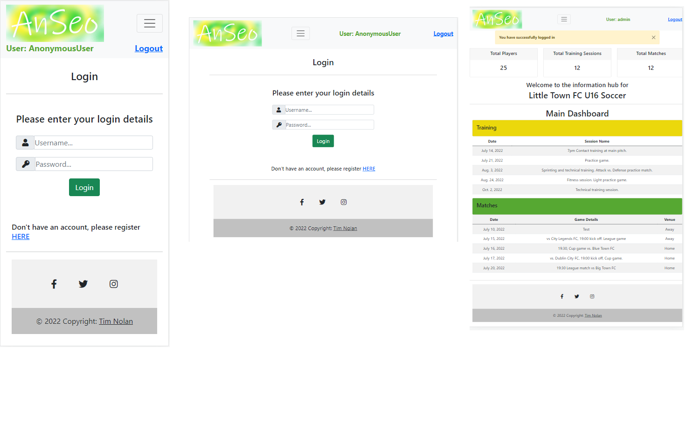

# An Seo
​
<span style="font-weight:bold; font-size:16px">
[An Seo](https://an-seo.herokuapp.com/) is a web based application which allows managers and coaches of to track the attendance of their players at training and for matches. The application is primarily designed for underage and amateur sports.</span> 
<br>
[This is an external link to An Seo](https://an-seo.herokuapp.com/)

<span style="color:#56a832; font-weight:bold; font-size:16px">Origins of the application.</span>
<p> The initial inspiration for the application was formed while I was assisting with coaching of my daughters Camogie team. I became aware that the manager was using a hand written list to record player attendance.</p>
<p>I initially assumed that this list was acting as some form of track and trace to comply with Covid regulations. When I asked the manager about the purpose of the list he told me he was recording player attendance at every training session in order to help him fairly pick his teams. The information would also serve as record which could easily settle any little disputes that parents may have about their childs game time.</p>
<p>The manager then shared a link to a Google Drive containing Google Sheets where he was recording the attendance. He would bring home the paper list and manually update the sheet.</p>

<span style="color:#ebd80c; font-weight:bold; font-size:16px">A proposed solution.</span>
<p>Having looked at the Google Sheets it appeared to me that a data would better stored in a database and so was very suitable for use in a Django driven project.</p>
<p>At its basis, the problem could be easily addressed with a cloud based application
</p>
<ul>
<li>Data located in the cloud which would be eaily updateable through a mobile device.</li>
<li>Data would be collected and the database would be updated in the same process.</li>
<li>Any query or queries called from the data would be updated with the fresh data.</li>
</ul>
<p>It also seemed clear that once the manager/site owner was recording this data then it could be used for further purpose and features to enhance the use and function of the application.</p>

<br>

[Site display on different screens](/media/read_me/responsive_screen_shot.png)


​

## Contents
​
- [Anseo](#contents)
  - [Contents](#contents)
  - [UX](#ux)
    - [Project Goals](#project-goals)
    - [Site Owner Goals](#site-owner-goals)
    - [Site Visitor/User Goals](#site-visitoruser-goals)
    - [User Stories](#user-stories)
    - [User Requirements and Expectations](#user-requirements-and-expectations)
      - [**Requirements**](#requirements)
      - [**Expectations**](#expectations)
    - [Design Choices](#design-choices)
      - [**Fonts**](#fonts)
      - [**Colours**](#colours)
  - [Wireframes](#wireframes)
    - [**Site Layout**](#site-layout)
  - [Information Architecture](#information-architecture)
  - [Technologies](#technologies)
    - [Languages](#languages)
    - [Libraries & Frameworks](#libraries--frameworks)
    - [Tools](#tools)
  - [Features](#features)
    - [Implemented Features](#implemented-features)
    - [Future Features](#future-features)
    - [Redundant features](#redundant-features)
  - [Changes applied since planning](#changes-applied-since-planning)
  - [Testing](#testing)
  - [Deployment](#deployment)
    - [Local Deployment](#local-deployment)
    - [Deployment to Github](#deployment-to-)
  - [Credits](#credits)
    - [Images](#images)
    - [Image editing](#image-editing)
    - [Code ideas](#code-ideas)
  - [Acknowledgements](#acknowledgements)
​
---
​
## UX
​
### **Project Goals**
​
The main goal of this project is to provide coaches of sports teams the ability to track the attendance of the players at training sessions. This data then gives the user a simple visual guide as to which players are regularly participating and so aid the coach/manager in portioning game time when it comes to competitive games and matches. The application was primarily designed for underage amateur sport but could be used at any level.

​
### **Site Owner Goals**
​
- Provide the users with a simple system to collect information and display that information in a simple readable format.
​
<br>

### **Site Visitor/User Goals**
​
- Site visitors will have the ability to view the details of upcoming training sessions and match fixtures. The typical site visitor will be a parent or guardian of a child who is part of the team or a member of a team itself.
<br>
- Site users will have the ability to...
    
    <ul>
    <li>Create, Update and Delete Players.</li>
    <li>Create, Update and Delete Training Sessions.</li>
    <li>Create, Update and Delete Matches.</li>
    <li>View player attendance histories.</li>
    <li>View records of training sessions.</li>
    <li>View records of team selections.</li>
    </ul>

​
### **User Stories**
​
**Applies to all site users:**
​
- As a user, I am able to...view upcoming training sessions and matches.

​
**Applies to a superuser (site owner):**
​
- As a user, I am able to...
<ul>
<li> Create, update and delete Players. </li>
<li> Create, update and delete Training Sessions. </li>
<li> Create, update and delete Match/Fixtures. </li>
<li> View a players attendance at training. </li>
<li> View a players attendance at games. </li>
</ul>
​<br>

[Back to content](#contents)

---
​
### User Requirements and Expectations
​
#### **Requirements**
​
- Visually pleasant app design
- Easy site navigation
- Information of the content laid out in a simple and clear way on both mobile and larger screens
- Self-explanatory icons where text is absent
​
#### **Expectations**
​
- Easy to use interface.

​<br>
[Back to content](#contents)

---
​
### **Design Choices**

The site/application is designed and styled using Bootstrap and is presented in a 'dashboard' style layout. With the focus of the application being on the display of information and functionality I have made deisgn choices based around this.   
​
#### **Fonts**
I have decided against using Font Awesome or any other resource Font library, I have used the default Bootstrap font library.

- *All fonts* 

​
  ```font-family: Bootstrap standard font -  sans-serif;```
<br>

#### **Images**
The only image I am using is the logo which I created I a desktop publishing application. I have given the application the name 'An Seo' which is the Irish / Gaelic for 'here'. Anyone of certain age who attended primary school in Ireland would be familiar with the phrase as response to a teacher calling your name to take a class attendance.

<p align="center" width="100%"> 

</p>


#### **Colours**
After experimentation the background colour has been left white.
<ol>
<li>This will help keep the screen bright and 'clean'</li>
<li>White offers a better contrast with the displayed information</li>
</ol>

To break this white colour I have added two colours, a green and a yellow, to style some container and card items and create some divisions on the screen. 

<p align="center" width="100%"> 

</p>
​
Any other colour on the screen is comes from a Bootstrap styled button. The only exception to this is the colour on the Player Dashboard section which signifies the players attendance record.
​
<br>

[Back to content](#contents)
​

---
## Wireframes
​
### **Site Layout**
​The site layout and mock-ups sketches were drawn free hand with pen and paper.

Preliminary wireframe sketches were made to create intial structure to the screen layout and the content.

<br>

<p align="center" width="100%"> 

</p>

<br>

<p align="center" width="100%"> 

</p>

<br>

<p align="center" width="100%"> 

</p>

<br>


As the sketches has been rendered there has been UX design and layout changes verus the orignal wireframes. Slight style changes were made early in the design process following some live testing.
​

[Back to content](#contents)
​

---
​
## Information Architecture
​
### **PostgreSQL Database**
The backend database is PostgreSQL Database hosted via Heroku. The database is built around 5 models.
#### **Models:**
<ul>
<li>Club</li>
<li>Team Selection</li>
<li>Match</li>
<li>Session</li>
<li>Player</li>
</ul>
<br>

<p align="center" width="100%"> 

</p>

<br>


**Club Model**

This models holds only one field at present. I am using this to hold the Name of the club for which the data relates to. The club name value is then displayed on the Main Dashboard. 

**Team Selection Model**

The Team Selection Model holds match related data. The model combines the instance of a particular match and allows the user add a player to that match. The coach can also give the player and jersey number and status of *starting* the match or *substitute*. 
The model also contains fields *goals, points* and *notes*. It is envisaged that these fields would be used in an **In Play** module which would form part of [Future Features](#future-features).

**Match Model**

This model is for the creation of a new match. It holds *date, details* and *venue*. 

**Session Model**

The Session model is for the creation of a new training session. This model was the basis for the site. I spent considerable time getting this model and its subsquent for correct. 

I want to follow a simple sequence
<ol>
<li>Select the date of the training.</li>
<li>Write a small note about the session details.</li>
<li>Add the players in attendance to that session.</li>
</ol>

I wanted to display all the players from the **Players Model** and simply check them as being present. I did not want to *add* each manually or select a player from a drop list or a formset. 

This process needed to be simple and clean, if I could not render the form in such away then for me it would jeopardize the whole application.

After much experimentation and searching I found a solution on Stack Overflow which I was able to adapt.

```
class CustomMMCF(forms.ModelMultipleChoiceField):
    def label_from_instance(self, player):
        return "%s" % player.name


player = CustomMMCF(
        queryset=Player.objects.all(),
        widget=forms.CheckboxSelectMultiple
    )
```

**Players Model**
Player model holds the players *name, date of birth, contact number* and *Irish name*. I use the *date of birth* to calculate the players current ages. As the application was initially from a Camogie stand point I decided to include a field for a coach to enter the players Irish name. As [Future Features](#future-features) the application could generate a team sheet which would display players Irish name along with the jersey number which would be a requirement under the GAA/Camogie rules and regs. 


​
[Back to content](#contents)
​

---
​
## Technologies
​
### Languages
​
- [HTML](https://developer.mozilla.org/en-US/docs/Web/HTML)
- [CSS](https://developer.mozilla.org/en-US/docs/Web/CSS)
- [JavaScript](https://developer.mozilla.org/en-US/docs/Web/JavaScript)
- [Python](https://www.python.org/)
​
### Libraries & Frameworks
​
- [Django](https://www.djangoproject.com/)
- [jQuery](https://jquery.com/)
- [Bootstrap](https://getbootstrap.com/)
- [Crispy Forms](https://django-crispy-forms.readthedocs.io/en/latest/)
​
### Tools
​
- [Git](https://git-scm.com/)
- [GitHub](https://github.com/)
- [Heroku](https://www.heroku.com/)

[Back to content](#contents)

---
​
## Features
​
The application  uses a PostgreSQL database which contains the purpose designed models.
​
The site uses the Django and Bootstrap 

### Implemented Features
​
- The site has **responsive design** when viewed on a mobile, tablet, and desktop.

- **Easy navigation** to external sites, such as social media accounts.

- The site has **three levels of user access**,

<p align="center" width="100%"> 

</p>

The levels are <span style="color:#ebd80c; font-weight:bold">'admin','coaching' and 'visitor'.</span>
These are three groups which were created in the Django Administration panel.

The **admin** group consists of the 'team manager' or administrator whom has full access to all features of the application.

The **coaching** group consists of a login for the other coaching staff. The members of this group have access to the Main Dashboard and the Training menu. This will allow members of the coaching group full functionality to create, update and delete training sessions with ability to adding and removing players.

The **visitor** is for memebers of the team and guardians and parents. Members of this group are allowed access to the Main Dashboard only. This will allow them see upcoming training and match fixtures.

As default all new members which register with the account are put into the **visitor** group. 

<p align="center" width="100%"> 

</p>


### Future Features

- An In-Play feature which would allow the manager enter scores in real time. This would display 'live' information on the match for the memebers with access to the the Main Dashboard so they could get up to date information on their childs games if they could attend. This would incorporate a timer or clock.

[Back to content](#contents)
​

---
​
## Testing
​
## Functional Testing
​
TC001 
​
**Description**
​
Test something.
​
**Steps**
​
- Navigate to https://website
- 
​
**Expected**
​
This happened
​
**Actual**
​
This happened
​

​
<hr>
​
TC002
​
​
## Validator Testing
​
### CSS
​
Base Css
​

​
### JavaScript
​
Base JS
​

​
### HTML
​
The following Validated with no errors:
- Home Page
- 
​

​
The Following Validator with the same error:
- The something page
​

​
​

[Back to content](#contents)
​

---
​
## Deployment
​
### Deployment:
<br>

Deployment of this project is carried out with  Heroku, https://www.heroku.com . The deployment procedure is a follows.  
<ol>
<li>Log in to Heroku, creating a new account if you are not a current user.</li>
<li>Click on the 'New' button in the top right corner and from the drop-down menu select 'Create new app'.</li>
<li>Create an App name and select your Region from menu.</li>
<li>Click the 'Create App' button.</li>
<li>You will now have a menu for your new app. From here click on the Settings Tab and in the Config Vars. Click Reveal Config Vars.</li>
<br>
<p align ="center">
</p>
<br>

<li>You need to create Config Vars for the Google API Credentials. Enter 'CREDS' as the KEY and then copy the entire contents of the creds.json file from GITPOD in the VALUE section, click the Add button to finish.  </li>
<li>A second Config Vars will be required. In the KEY box enter 'PORT' and in the VALUE box enter 8000 and then click the Add button.</li>
<li>Scroll down to the Buildpacks section. Click Add buildpack. From the menu select Python and click Save Changes. </li>
<li>Click Add buildpack again and Node.js. The Buildpacks must added in this order. If not, you can click on the packs and drag them to the correct order as shown in the image.</li>
<br>
<p align ="center">
</p>
<br>
<li>Return to menu at the top of the page and click on Deploy. Select Github as the deployment method.</li>
<li>Confirm you want to connect to GitHub using your account credentials for Git. Once Heroku has access search for the relevant repository name and click the connect button.</li>
<li>At the bottom of the deploy page select the preferred deployment type. You can use Manual Deploy which will deploy based on the current state of the selected Git branch. You can also Enable Automatic Deploys for automatic deployment when you push updates to Github selected branch.</li>
<br>

[Back to Contents](#contents) 
<br>

### Cloning:

[Click here](https://help.github.com/en/github/creating-cloning-and-archiving-repositories/cloning-a-repository#cloning-a-repository-to-github-desktop) to retrieve pictures for some of the buttons and more detailed explanations of the above process.

1. Log in to GitHub and locate the [GitHub Repository] https://github.com/TNolan01/player_track
2. Under the repository name, click "Code".
3. To clone the repository using HTTPS. Under "HTTPS" copy the link.
4. Go to your local terminal with git installed
5. Change the current working directory to the location where you want the cloned directory to be created/located.
6. Type `git clone` and then you paste in the URL you copied in Step 3.

  ```
  $ git clone https://github.com/TNolan01/player_track
  ```

7. Press Enter. Your local clone will be created.

<br>

[Back to Contents](#contents) 
<br>
​

---

​
## Credits
​
### **Images**
​
I have not used any images for this application.
​
### **Image editing**
The logo I use was created with MS Paint.
​
### **Programming resources**
Aside from the Code Institue content for this section I used the following resources.

- [Stack Overflow](https://stackoverflow.com/)
- [CodeMy.Com on YouTube](https://www.youtube.com/watch?v=HHx3tTQWUx0&list=PLCC34OHNcOtqW9BJmgQPPzUpJ8hl49AGy&index=2)

<br>

[Back to content](#contents)
​

---
​
## Acknowledgements
​
Site creators:
​

​
[Back to content](#contents)