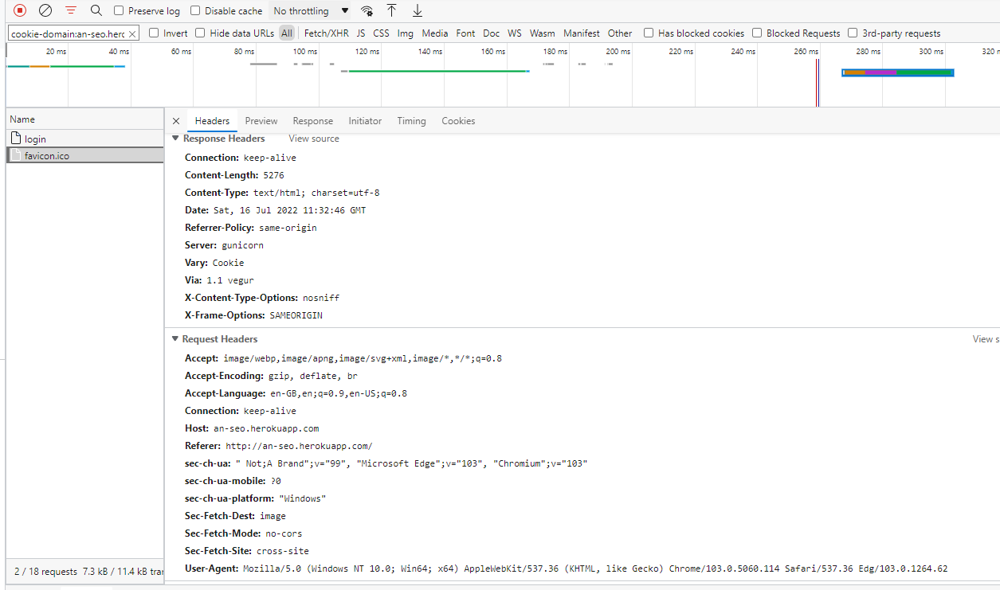
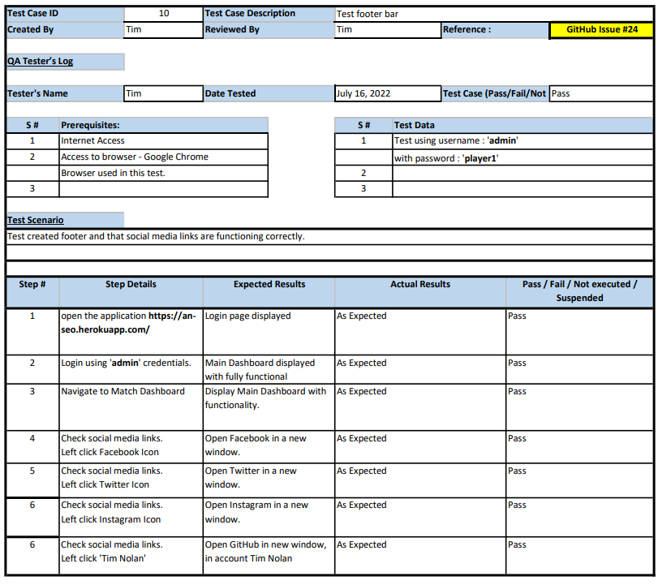

# An Seo

Return to Read Me Document [here](README.md)
## Contents
- [Testing Round 1](#testing-round-1)
- [Error 403](#error-403)
  - [Current Status](#current-status)
- [Testing Round 2](#testing-round-2)

 

## Manual Testing
Testing of USER STORIES

I carried out manual testing as follows, incorporating USER STORIES and ISSUES from the Agile Kanban.

[Kanban Board](https://github.com/TNolan01/player_track/projects/1)

 

## Testing Round 1

 

 

 

 

 

 

 

 

 

 

 

[Back to content](#contents)

## Error 403

HTTP vs. HTTPS Issue

Test Case No.9

During the testing I discovered that when I entered the name of the application into the Microsoft Edge browser as 'an-seo.herokuapp.com' without prefacing it with 'http:// or https://' then the application was opening as http://an-seo.herokuapp.com in the Edge browser. The Login screen was rendering correctly but if any user attempted login the application would get a 403 Error relating to CSRF issue as soon as the user clicked the Login button.

I initially thought this was a Microsoft Edge issue. Without being prefaced with https://, Edge defaulted to http:// protocol. If I entered the entered the site as https:// there would be no login issues. Possibly a security issue or setting on the Edge browser?, not a browser that I use.

Having checked further I found that if I used http:// on Google Chrome I was able to replicate the 403 error and so the issue was not unique to Microsoft Edge.

Initial Fix.

I checked code and found all csrf_token's were located correctly in the relevant forms and I could see not issues in the views.py. My initial fix to the issue was to create a custom 403 page.

When triggered by a 403 Error the custom 403 page would revert the user back to a secure HTTPS connection, https://an-seo.herokuapp.com, and the application would be fully functional from that point.

Further Investigation Of Issue.

- Investigation of similiar issues suggested adding CSRF specific settings in the settings.py But of these related to Django 4+ and not Django 3 as I am using. Having experimented with these settings I found that they had no impact on the issue.    
- Opening the Login Page through Google's Developer Tools showed that the form had created a CSRF token.

 

 

- Potential solutions suggested using a decorator, @csrf_exempt on particular views to bypass the issue. I also found information about changing SESSION_COOKIE_SECURE and CSRF_COOKIE_SECURE in the settings.py. 
Neither of these settings were in the Code Institute template and so I did not see the advantage of adding them just to set them to FALSE and weaken the security of a CSRF token.

 

 

- Opening Developer Tools in the Microsoft Edge browser and carrying out further testing the error shown was Cross-Origin Read Blocking (CORB)

 

 

This error was indicating the issue was with  favicon.ico
At this point of testing I was not using Favicon or had no reference to it in my code.

Further testing by connecting to my application through the HTTP protocol and the HTTPS protocol and checking showed that on HTTP, Favicon.ico was not creating a CSRF Token but when connecting through HTTPS it was generating a CSRF token. I do not know enough about the browsers request for a Favicon logo.

I generated a Favicon logo, uploading the image file to Cloudinary, as static storage, and referenced the file in the header of my main.html but this didnt clear the issue.

HTTP Protocol

 

 

HTTPS Protocol

 

 

### Current Status
Current Status of Error

The issue still exists but my initial fix of custom 403 page is the work around if a user encounters the problem.

I cannot find any further information on this issue in relation to Favicon but I will return to it after further function testing.

[Back to content](#contents)

## Testing Round 2

 

 

 

 

 

 

 

 

 

 

 

 

 

 

 

 

 

 

 

 

 

 

 

Screen shot show existing match fixtures prior to test.

 

 

 

 

 

 

 

 

